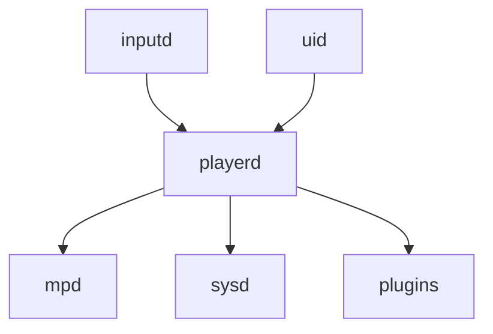

# System Overview

## System philosophy

Stable core + flexible edges.

## Core services

mpd
Audio playback engine.

playerd
System orchestrator.

inputd
Hardware input handler.

uid
User interface.

sysd
System services.

## Architecture diagram

## Responsibilities

playerd owns product logic.

mpd owns playback.

uid owns rendering.

inputd owns hardware events.

sysd owns system state.

## Core rule

Audio playback must function without UI.
